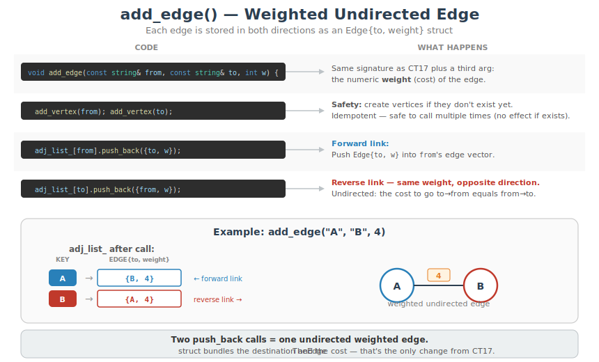
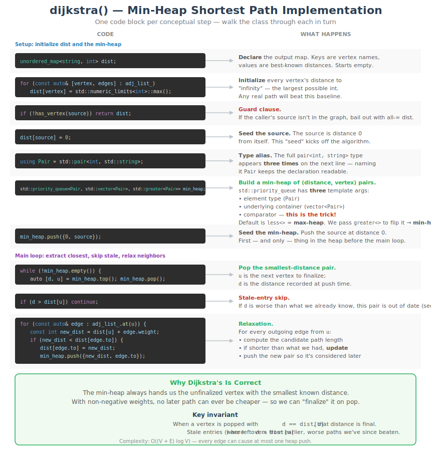
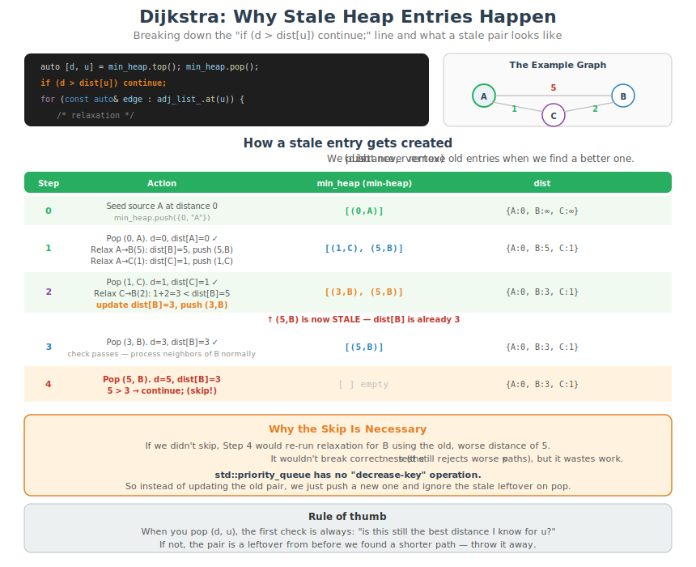
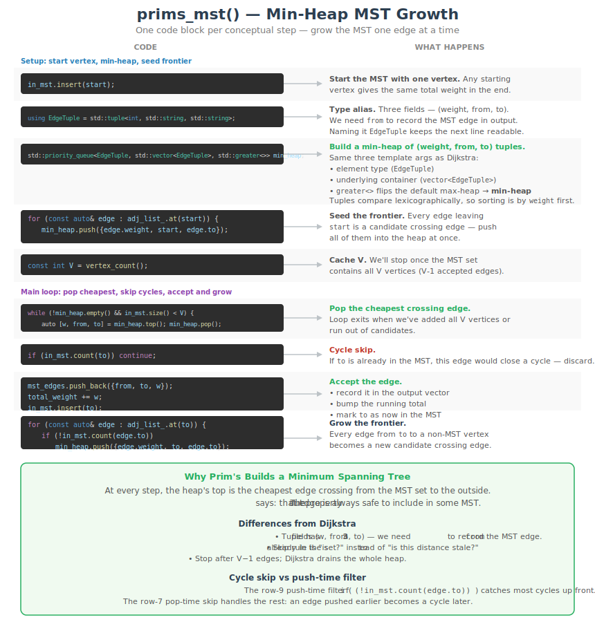

# CT18 -- Implementation Diagrams

Code-block diagrams referenced from `WeightedGraph.cpp`.

---

## 1. add_edge() — Weighted Undirected Edge
*`WeightedGraph.cpp::add_edge()` -- push `Edge{to, weight}` into both neighbor lists*

---

## 2. dijkstra() — Min-Heap Shortest Path
*`WeightedGraph.cpp::dijkstra()` -- init distances, relax edges through a min-heap until empty*

---

## 2a. dijkstra() — Stale Entry Skip Breakdown
*`WeightedGraph.cpp::dijkstra()` -- why `if (d > dist[u]) continue;` is needed and what a "stale" heap entry looks like*

---

## 2b. dijkstra() — Code Execution Trace
*`WeightedGraph.cpp::dijkstra()` -- tracing dijkstra("A") step by step: heap pops, relaxation checks, dist updates*

---

## 3. prims_mst() — Min-Heap MST Growth
*`WeightedGraph.cpp::prims_mst()` -- grow MST one vertex at a time by popping the cheapest crossing edge*

---

## 3b. prims_mst() — Code Execution Trace
*`WeightedGraph.cpp::prims_mst()` -- tracing prims_mst("A") step by step: heap pops, cycle-skips, MST growth*

